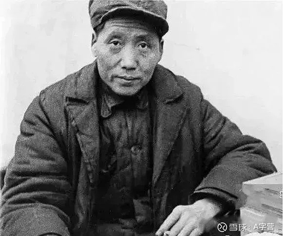
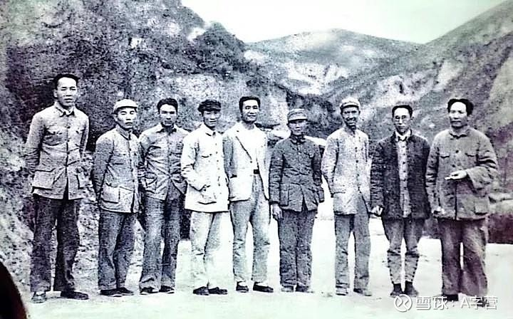
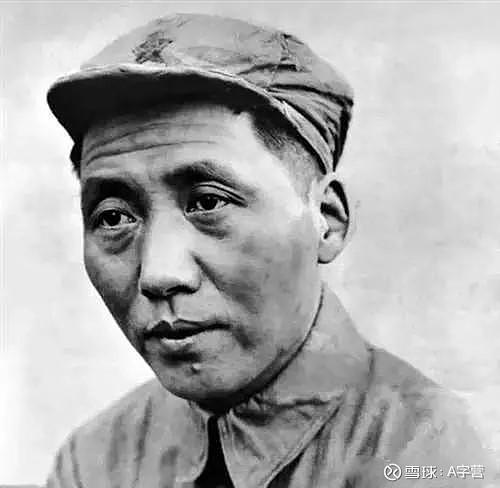

## 毛主席的人生低谷

陈毅曾说过：
“毛主席是一个受过污辱、冤枉和虐待的人，但他从未向命运屈服过。他在监狱里受尽挫折，却始终没有丧失对革命事业的信念。……他被撤过职，受过党内审查，被宣布为机会主义者，蒙受耻辱，被送往后方休养。没有人去看望他，因为谁也不敢接近他。”

### 1. 被骂为“乡巴佬”

1931年6月，向忠发被捕。斯大林以共产国际名义指定莫斯科中山大学校长米夫的学生王明担任我党的“一把手”。

除了王明，当时的中央政治局常委还有3人，分别是是博古、张闻天和卢福坦（后叛变）。

王明、博古、张闻天，出自同一师门，他们的老师是莫斯科中山大学校长米夫——共产国际中国部部长。

于是，他们全盘照搬苏联的政治体制和意识形态，教条地认为，中国只有走俄国革命的道路，先武装夺取中心城市，才能夺取全国的政权，进而对不符合苏联模式的一概予以排除和打击。

教员这个被博古视为“山沟里出不来马列主义”的人，当然在排斥打击之列。

1931年底，王明派博古到瑞金主持工作，召开中央苏区第一次党代会(也称赣南会议)，会上指责教员为“狭隘的经验主义”，甚至骂他：

“你懂什么马列理论？简直就是一个乡巴佬！”

这不仅是个人感情问题，而且是方向路线和价值观的根本不同。

到了1932年10月，更大的挫折来了，王明领导的中央政治局的全体委员集体把教员选下了台。

原因是共产国际要求红军打南昌，教员认为南昌国民党重兵把守，打不得；让打赣州，教员认为赣州铜墙铁壁，也打不得。

共产国际觉得，给脸不要脸是吧，那就一边玩去吧，让他到福建长汀福音医院养病。

1933年1月，博古一行路过长汀时，有人建议他去看望一下正在那里养病的教员，这位26岁的负责人居然轻蔑地说：

“小毛（此时已经40岁），有什么好看的！”

1931年到1934年，四年时间，是教员难熬的日子。

他在延安时曾轻描淡写地对人讲，他在瑞金的中央苏区“过了四年小媳妇日子”。

教员所受的苦，我们很难完全体会。只能从他乐观豁达的回忆中，感受一二：

“他们把我这个木菩萨浸到糞坑里，再拿出来，搞得臭得很。那时候，不但一个人也不上门，连一个鬼也不上门。我的任务是吃饭、睡觉和拉屎。还好，我的脑袋没有被砍掉。”

以上所述，其实已经是教员的第三次人生低谷了。

### 2. 被“党内严重警告处分”

教员和其他早期共产党人不一样的是，他既没有赴法勤工俭学，也没有留学苏联，而是选择了留在国内做工作。

他是这么认为的：

“我觉得求学实在没有‘必要在什么地方’的理，‘出洋’两字，有好些人只是一种‘迷’。中国出过洋的总不下几万乃至几十万，好的实在很少。多数呢？仍旧是糊涂，仍旧是‘莫名其妙’。”

学知识，特别是人文社科，确实没必要非得出国，更何况连普通话也夹杂着浓重湘音，要将“Thank you very much（非常感谢）”标注为“三块肉喂你马吃”才能勉强开口的教员，出国了，又能学到什么东西呢？

但是交朋友，特别是和牛人朋友一起出国，就不仅仅是学知识这么简单了。

正如现在很多家长挤破脑袋也要送孩子读名校一样，他们哪里是想孩子学知识，他们觊觎的是孩子在名校混圈子、积人脉。

毕竟周恩来、邓小平、陈毅、聂荣臻、李维汉、李立三等，都是赴法勤工俭学的师兄弟。

而王明、博古、张闻天、王稼祥、杨尚昆、李竹声、乌兰夫等，都是毕业于莫斯科中山大学的校友。

他们吃在一起，住在一起；读同样的书，唱同样的歌，长此以往，从个人的感情出发，教员不可避免地容易处于被“孤立”的状态。

因为，他既没有牛逼的导师，也没有牛逼的爹——他是一个没有根基却想干大事的湖南乡里来的伢子。

想干事，先做人，先得认共产国际这个爹。而教员偏偏不服气，认为共产国际完全不了解中国国情，将红军带歪了，将会葬送中国革命。

早在1928年共产国际早就对教员不爽了。

1927年秋收起义，原计划攻打长沙，而教员却调转方向上了井冈山，并满怀信心地指出：

“我们当前的力量还小，还不能去攻打敌人重兵把守的大城市，应当先到敌人统治薄弱的农村，去保存力量，发动农民革命。我们现在好比一块小石头，蒋介石反动派好比一口大水缸，但总有一天，我们这块小石头，一定要打烂蒋介石那口大水缸，胜利一定属于我们。”

当时的中央负责人翟秋白知道后，大为恼火，认为中国革命形势是“不断高涨”，中国革命性质是“不断革命”，批评教员在秋收起义指导上“完全违背中央策略”，会议决定开除他的中央政治局候补委员职务。

当特派员周鲁到井冈山传达中央决定时，只记得要开除，却把开除什么给忘记了，结果误传为“开除党籍”，免去了教员的前委书记和党代表职务。

以上，教员的第一次人生低谷，郁闷了一个月，直到见到了中央文件后，才恢复了他的党代表的职务。

1929年5月，朱毛红军下井冈山，转战赣南、闽西开辟新的根据地。

期间，教员和朱德、陈毅在一系列问题上发生了严重分歧。其中，最核心的问题就是“军队归谁领导、听谁指挥”的问题，一些出身旧军队的指挥员，虽为共产党员，但并不清楚党究竟该如何领导军队，习惯于“长官说了算”，对一切行动听党指挥感到很不适应，认为教员领导的前敌委员会“管的太多”、“权力太集中”。

还有一些军官的流寇思想十分严重，认为“老子打仗拼了命，拿点东西怎么了？”对党的政策“不拿群众一根一线”很不理解。

1929年6月，没有经过改造的红四军召开党的第七次代表大会，否定了教员的一系列建军思想，并给他“党内严重警告处分”，还被选掉了前敌委员会书记，由陈毅当选为书记。

这是教员一生唯一一次被下级夺了权。他后来回忆说：

“内部同志不谅解，把我赶出红军，当老百姓了，做地方工作。”

1929年9月下旬，红四军召开党的第八次代表大会，会前，给教员写信，让他参加会议。教员回信说：

“陈毅要我做八边美人，四面讨好，我办不到；红四军党内是非不解决，我不能够随便回来；再者身体不好，就不参加会了。”

因此信，教员再次受到“党内警告处分”，并要他马上赶来。教员只得坐担架到上杭。但他赶到时，会议已经结束。

战友们见到此时的教员，面色蜡黄，脚和肚子都浮肿起来，高烧不退，上吐下泻，病得很厉害。

国民党媒体造谣说，教员已死于肺结核病。共产国际听到教员病逝消息后，于1930年初在《国际新闻通讯》上专门补发1000多字的讣告，对教员作出了如下评价：

“作为国际社会的一名布尔什维克，作为中国共产党的坚强战士，毛泽东同志完成了他的历史使命。”

离开红四军的140天，是教员人生的第二次低谷，不仅落选前委书记，失去军事指挥权，又受到病痛的折磨，可谓身心交病。

### 3. 没有永远的低谷

教员的日子从来就不是什么岁月静好。

一个湖南乡里人，20岁到长沙求学，几年后又到北京，成为了北漂，没有名气、没有工作、没有收入、没有房子。

他在老师的推荐下，到北京大学当图书馆管理员，一个月工资8元。为了省钱，他和七个人合租在棺材房里，大家挤在炕上，几乎透不过气来，每逢翻身都得预先警告身旁的人。

近年来，网络上有这样一种说法，说的是教员早年在北大图书馆当管理员时，因对前来找书的傅斯年照顾不周，挨了傅斯年的一记耳光。此事自然无从考证，但是从他后来的回忆中，可见艰辛：

“由于我的职位低下，人们都不愿同我来往。我的职责中有一项是登记来图书馆读报的人的姓名，可是他们大多数不把我当人看待。在那些来看报的人当中，我认出了一些新文化运动的著名领导者的名字，如傅斯年、罗家伦等等，我对他们抱有强烈的兴趣。我曾经试图同他们交谈政治和文化问题，可是他们都是些大忙人，没有时间听一个图书馆助理员讲南方土话。”

后来教员参加了革命，建立了井冈山革命根据地，开辟了“农村包围城市”的革命道路，却受到了那么多不公正的打击——

1928年，井冈山上被误开党籍；

1929年，在福建龙岩落选红四军前委书记；

1931年到1935年初，长征前后，完全丧失了党权、军权，变成一个无职无权的“普通一兵”。

这八年，正值教员由“而立”步入“不惑”之年，除精神上的打击外，生活上筚路蓝缕，加上又患上了严重的疟疾和肺病，不可为不贫病交加！

面对一次次的人生低谷，一般情况下就消极了，甚至有的另立门户走向反面，而毛主席怎么做的呢？

他仍以大局为重，服从组织决定，忍辱负重忘我工作。

他一如既往地关注着硝烟弥漫的激战前线，不露声色地从事苏区社情民意的调查研究；手不释卷地研读马列著作；实事求是地总结对敌斗争和军队建设的经验教训……

周恩来回忆说，在撤销毛泽东红军总政委职务时，毛泽东对他说：

“需要我的时候，打个招呼我就来。”

面对挫折，教员不仅有积极的态度，同时，也在努力地争取他人的支持。

比如：张闻天。他是当时党内的“二把手”，也是博古的校友加老乡，也曾跟随博古狠狠地批判过教员。

但是，没有永远的敌人，也没有永远的朋友。

因为第五次反“围剿”失败，张闻天与博古、李德产生分歧，也被踢出了权利核心圈。

教员不计前嫌，和他聊文学、谈思想。张闻天与教员共鸣点越来越多，逐渐接受教员的正确主张。

再比如，王稼祥。他是军委副主席兼总政治部主任。在一次反围剿失利中，他被敌炸弹炸烂了肚子，到后方住院与教员在一起，相互之间越来越近，逐渐成为教员最坚定的拥戴者。

敌人的凶残教育了年轻的共产党的领导者们，用炮弹告诉了他们什么叫“实事求是”。而教员也用行动告诉世人，什么叫“把朋友搞得多多的，把敌人搞得少少的。”

谁能想到，曾经最坚定的反对者，能成为最勇敢的支持者呢？王稼祥在宁都会议上是这么表态的：

“我与毛并非旧交，相反与王明、博古却是老同学、老同事甚至同乡，对中央指示也一直是服从和执行的，但从几次反“围剿”的胜利中，从打赣州的教训中，感到教员的指挥是正确的。”

面对挫折，教员不仅没有消极沉沦，而且求学若渴。他后来回忆道：

“一些吃过洋面包的人不信任，认为山沟子里出不了马克思主义。1932年秋开始，我没有工作，就从漳州以及其他地方搜集来的书籍中，把有关马恩列斯的书通通找了出来，不全不够的就向一些同志借。我就埋头读马列著作，差不多整天看，读了这本，又看那本，有时还交替着看，扎扎实实下功夫，硬是读了两年书。”

周恩来曾在一个青年会议上，讲如何学习毛泽东。他说：

“毛主席当着他的意见没有被大家接受时，他就等待，有机会他就又讲，又教育，又说服。在十年内战的时候，我们主张打大城市，毛主席认为我们力量小，不应该打大城市，应该集中力量建设根据地。但是毛主席的意见大多数不赞成，大家要打，他只好跟着打。结果打败了，毛主席赶快在会上提出：打败了证明这个办法不行，换一换吧！大家还不接受，他只好再等待，又跟着大家走。正确的意见是要经过许多等待、迂回才能取得胜利，为大家所接受。”

没有不变的事物，没有永远的兴盛，也没有永远的低谷。正如毛主席在 1956年9月10日中共八大预备会议第二次会议上所讲：

“我想同志们中间可能也有多多少少受过冤枉受过委屈的。对于那些冤枉和委屈，对于那些不适当的处罚和错误的处置(如把自己打成什么‘机会主义’、撤销职务、调离职务等等)，可以有两种态度。一种态度是从此消极，很气愤，很不满意；另一种态度是把它看作一种有益的教育，当作一种锻炼。你晓得，这个世界就是这么个世界，要那么完全公道是不可能的，现在不可能，永远不可能······”

 
 
 
 

作者：国服玩家

链接：https://xueqiu.com/6946459350/284739078

来源：雪球