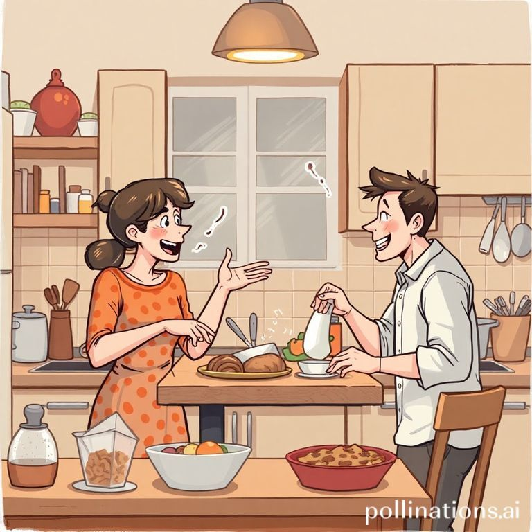
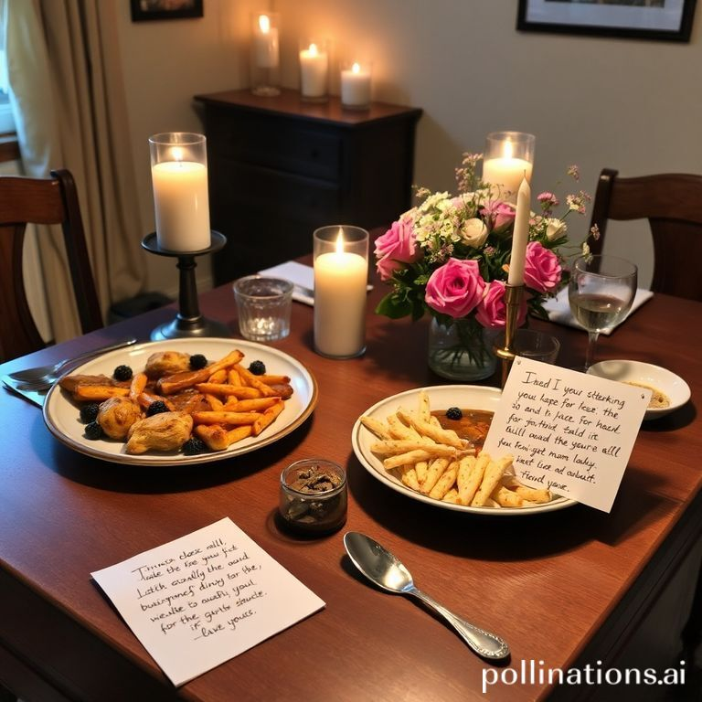

健康婚恋观：幸福的指南针
在现代社会，婚恋观已经成为许多人思考和探讨的热门话题。随着社会的不断进步，传统观念受到挑战，越来越多的人开始意识到，健康的婚恋观不仅对个人的发展至关重要，更是维系幸福生活的关键。作为一名生活在此时代的人，我希望通过深入的思考和具体的实例，来帮助大家更好地理解和建立健康的婚恋观。

#### 一、爱情的本质：理解与陪伴

许多人从小被灌输一个单一的爱情观，那就是爱情是一见钟情，或是轰轰烈烈的浪漫。但随着年龄的增长，我们渐渐明白，爱情的本质其实更多体现在理解与陪伴上。

实例：想象一下，一个朋友与她的伴侣相识多年，最初他们如同众多情侣一样，在约会中频频“甜蜜暴击”。然而，随着工作的压力和生活的琐事，他们的激情逐渐减退。起初，她对这一变化感到沮丧，认为爱情不再如昔日般炽热。然而，在一次深夜的谈心中，他们彼此分享近期的压力和烦恼，伴侣的理解与支持让她意识到，爱情的真正核心不是轰轰烈烈，而是相互扶持和无条件的理解。

这种理解是培养健康婚恋关系的基石。在日常生活中，我们需要时刻关注对方的情感需求，学会倾听和尊重。这种陪伴不仅仅体现在大事件上，更多的是在日常的小事中，比如一起做饭、散步时的闲聊，甚至是共度的无聊时光，这些点滴才是真正建立起感情基础的关键。

#### 二、沟通：消除误解的桥梁

在任何健康的关系中，沟通都是不可或缺的环节。很多时候，争吵都源于误解而非真正的问题。如何有效地沟通，成为了维护关系的重要技能。

实例：举个例子，一对情侣因为“谁来洗碗”这一小事而频频争吵。起初，他们互不相让，最终在愤怒中爆发。后来，他们决定坐下来认真询问彼此的感受。对方解释说工作压力大，心里积压了很多情绪，实际上冲突的根源并不是洗碗，而是缺乏沟通与理解。最终，他们达成共识，制定出每周的家务分配表，这不仅消除了潜在的矛盾，还让感情更加牢固。

高效沟通需要技巧。我们可以采用“我”语言而非“你”语言来表达观点。例如：“我希望能在家务上得到更多的支持”比“你总是不帮我”更能唤起对方的理解。创造一个开放的沟通环境，鼓励双方在没有压力的情况下分享感受，能够有效降低误解的发生。

#### 三、平等与尊重：爱情的基础

健康的婚恋关系建立在平等与尊重的基础上。每一个个体都有自己的需求、情感和空间，只有当彼此都能在关系中感到被重视与尊重时，感情才能持久。

实例：想象一对准备结婚的情侣，在谈到日后的生活时，男方希望女方完全放弃工作，而专心照顾家庭，女方对此感到震惊和不满。在几次的激烈争论后，他们决定寻求第三方的建议。通过专业辅导，男方意识到，女方的事业对她自我价值的实现至关重要。他们最终决定实现家庭与工作的平衡，让双方都能在各自的人生道路上共同前行。

在健康的婚恋关系中，两人需要保持独立。每个人都应当拥有自己的社交圈、兴趣爱好和个人空间。爱不是占有，而是理解与支持。尊重对方的选择，才能让感情更加美好。实际上，健康的关系应当是“我们”与“我”的平衡。

#### 四、处理冲突的艺术：成长的机会

冲突在任何关系中都不可避免，关键在于我们如何处理这些冲突。健康的婚恋观是将冲突视为机会，而不是威胁。通过有效的处理冲突，伴侣之间的关系可以变得更加牢固，加深理解。

实例：有一对恋人，他们出现了因金钱管理而引发的争执。经过一次激烈的争吵后，他们决定不再回避这一问题，而是坐下来详细讨论各自的理财观念和目标。在坦诚的交流中，他们了解到对方的立场和需求。最终，他们共同制定了合理的财务计划，甚至为彼此设定小目标，以增强彼此的信任与合作。

在处理冲突时，冷静和理智是关键。彼此都应努力理解对方的立场和情感，而不是攻讦和指责。在冲突结束后做一些反思，思考如何避免类似的问题再次发生，也是促进个人与关系成长的重要一步。

#### 五、共享目标与愿景：携手共进

在一段健康的关系中，共享目标和愿景让伴侣们能够朝着相同的方向努力，而这种共同的愿景将使婚恋关系更加稳固。

实例：许多夫妻在结婚前没有明确的共同目标，可能仅仅是因为“我们在一起很开心”，而不深入思考未来的规划。然而，某对夫妇在婚后决定共同发展一项循环经济的项目。通过设定目标，他们不仅加强了相互间的信任与合作，也在追求梦想的过程中实现了共同成长。

共享目标可以是财务上的、事业上的，甚至是个人成长的。重要的是，这样的目标应该是双方都认可的。在日常生活中，定期回顾这些目标并调整进度，能让双方在事业与生活中都步调一致，创造共同的幸福。

#### 六、自我成长与反思：爱的滋养

健康的婚恋观不仅需要专注于彼此，也要关注个人的成长与发展。每个人的自我成长将为婚恋关系注入新的活力，而这种活力又能够推动彼此更深层的理解和亲密。

实例：一位朋友在婚后将大部分的注意力和精力都放在了家庭上，渐渐忽视了自身的发展。随着时间的推移，她发现自己感到越来越不快乐，情绪也影响到了婚姻。最终，经过一番自我反思，她决定重新拾起个人兴趣，参加了一些课程和活动。这不仅让她的生活重新焕发活力，也让她的婚姻质量明显提升。她的伴侣被她的新热情感染，双方关系变得更加融洽。

自我成长是婚恋关系一个不可忽视的重要部分。彼此都应当鼓励对方去追求自己的兴趣与梦想。当两个人都在成长时，感情自然会不断升温。

#### 七、爱情中的小细节：点亮生活的火花

有时，影响关系的并不是那些重大的事件，而是日常生活中的细节。健康的婚恋观强调在生活中多注重那些小的细节，让彼此感受到爱的存在。

实例：一位丈夫发现，伴侣最近工作压力很大，便在周末精心准备了一顿丰盛的晚餐，并给她留下了一张温馨的纸条。虽然这仅仅是一次小小的举动，但却让妻子感受到了无比的温暖与关心。相反，若我们忽视每天的小细节，关系就容易陷入平淡与乏味。

小细节中蕴藏着关心，可以是一个温暖的拥抱、一句贴心的问候，甚至是送给对方的小惊喜。这些微小而温馨的举动，将为爱情点燃持久的火花。

#### 结语
综上所述，健康的婚恋观应该是建立在理解、沟通、平等、冲突处理、共享目标、自我成长与小细节的基础上。爱情是人类最美好的情感之一，而健康的婚恋观则为这段情感的维持与升华提供了方向。希望每个人都能在这个复杂的时代中，找到属于自己的幸福，携手共进，迎接未来的每一个挑战！

我们都在这条路上学习与成长，携手的每一步都值得我们珍惜与铭记。让我们为彼此的爱情干杯，期待着今后更美好的每一天！