## 第一章：小米汽车的起点

大家晚上好，欢迎大家参加我的第五次年度演讲。现场来了很多的朋友，还有很多朋友正在观看直播，我再次欢迎大家的到来。

3 月 28 日，小米 SU7 正式发布，其热度远超我们的想象，一夜之间成为了现象级的爆品。

过去的三个多月里，我感觉每天都像在梦里一样。回顾过去 1000 多个日日夜夜，小米汽车经历了太多的起伏和故事。许多人可能都知道，小米造车始于一个意外。

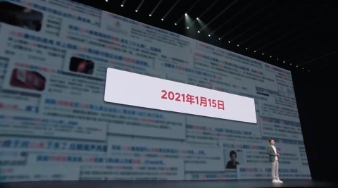

那是在 2021 年 1 月 15 日早上 7 点多，我在上班路上接到一个朋友的电话，他说：「雷总，你们被美国制裁了。」那消息犹如晴天霹雳，我立刻感到困惑。我们很快召开了紧急董事会，商讨对策。

就在那次董事会上，一位董事问：「如果你们的手机业务不能继续，你们三四万人怎么办？」是的，如果我们的手机业务不能继续，我们该怎么办？一位董事建议：「你们要不要认真考虑一下造车？」
 
当天下午，我们第一次认真讨论了造车的问题。几乎所有高管都支持我，认为造车风险太大，我们应该先进行调研。于是，我们组成了一个六人的调研组，在 70 多天的时间里，我们马不停蹄地访问了 10 多
个城市，有时早晨出发晚上返回，风尘仆仆地调研了 85 场，面访了 200 多人。在这个过程中，还开
了 4 次高管会议。

在调研过程中，有两位好朋友一直力劝我造车，他们是李斌和何小鹏。

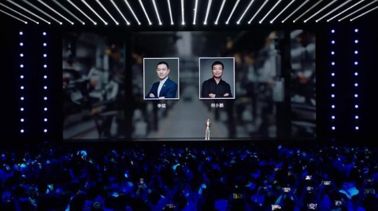

说实话，我在写 PPT 时都在想，他们请我造车对他们有什么好处？他们难道不怕汽车行业多了一个竞争对手吗？我一直在思考，也许他们只是单纯地为小米好。随着调研的深入，我越来越感受到智能电动车的趋势已不可阻挡。

所以在 3 月 24 日向董事会汇报时，我是这样说的：「智能电动汽车是大势所趋，汽车行业正在与消费电子行业相结合。我认为小米必须参与进来。」

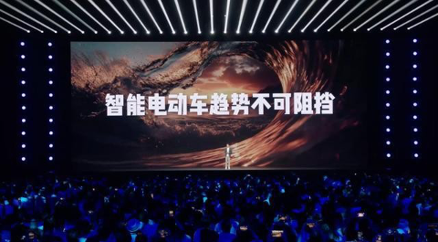

同时，我也表达了我的担忧：汽车行业会不会像手机行业一样，最终只有少数几家能够生存下来？如果我们不能进入全球前五，我们可能就无法生存。因此，如果我们决定造车，首先要有长期计划，其次要朝着全球前五的目标努力，这意味着我们需要准备投入大量资金。
 
我们当时认为至少需要 100 亿美元。经过董事们的激烈讨论，他们给了我肯定的答复，支持造车。但由于投入巨大，雷军本人必须亲自带队。

说实话，我完全没想到董事会会有这样的要求。在接下来的几天里，我每天都在挣扎。那时的小米正处在多事之秋，我们上市两年半，公司正从游击队向正规军转型，非常痛苦。而且我们手机的高端化刚刚开始，千头万绪。

就在这个时候，我们培养多年的年轻高管离职了，给我当头一棒，他就是周寿资。尽管心中有万般不舍，我还是送上了最诚挚的祝福。我们正处在多事之秋，这些事情交织在一起，让我内心非常纠结。

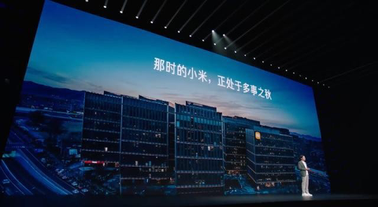

在这个关键时刻，我必须思考我们是否要造车，我自己是否要带队造车。这并不容易。我觉得在每一个深夜，我好不容易鼓起勇气决定大干一场，但第二天早晨醒来，太阳升起时，我又感到迷茫。

我反复问自己：创业这么苦，我真的还要从头再来一遍吗？风险这么大，万一输了，我这辈子就这么灰溜溜地收场吗？我真的有足够的体力和精力投入到一个全新的行业吗？

这些问题在我脑海中盘旋了整整一个星期，非常煎熬。

3 月 30 日，我正式回复了董事会：如果小米必须造车，如果大家认为我合适，为了小米，我愿意挺身而出。这不是一时冲动，也不是权宜之计，而是我多年来深思熟虑的结果。

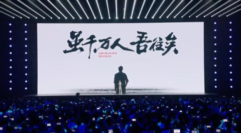

当时我心中只有七个字：「虽千万人，吾往矣。」即使面对千万人的质疑和阻拦，我也将义无反顾，勇往直前。当天，我们就正式宣布小米将进入造车领域，雷军带队，10 年内全资投入 100 亿美元。

小米造车 100 亿美元的消息震撼了整个行业。当天晚上，我们举办了发布会。其实我那天状态特别不好，重感冒，嗓子几乎都说不出话来。

在台上，我没有给自己留任何退路。我当时斩钉截铁地说，这是我人生最后一个创业项目，我愿意押上一生的声誉和成就，为小米汽车而战。现场响起了雷鸣般的掌声，大家给了我很多鼓励。直播屏幕上的弹幕全是「干翻特斯拉」，那一刻我百感交集。

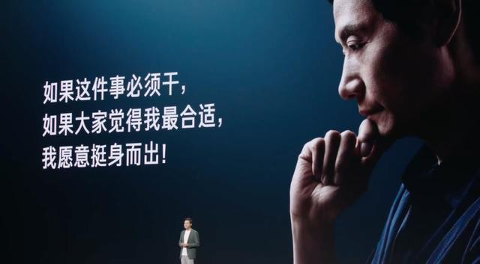

那天晚上是我们小米的不眠之夜，也是汽车行业的不眠之夜。我收到了很多信息，最打动我的是凌晨 5 点收到的一条信息。发信人是刘安昱，他是小米早期的创业者，37 号员工。

他从小就痴迷汽车，原以为这辈子与汽车无缘。他业余时间自己改装了一辆大房车。那天他正好在广州出差，看到我们的直播发布会后非常激动，拉着几个同事到珠江边喝酒，喝完后还不尽兴，又在江边走了整整一晚。到了凌晨 5 点，他终于下定了决心，这个机会他一定不能错过，给我发了条信息，只要让他参与，干什么都行。

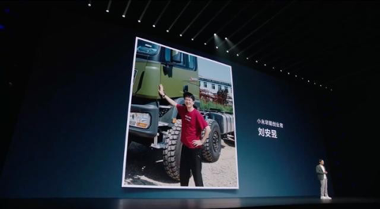

还有李田原，他当时在宝马德国总部负责 iX 车型的设计，是欧洲混得很不错的中国设计师。小米的发布会深深震撼了他，激发了他加入小米的愿望。放弃宝马总部的工作，放弃欧洲舒适的生活，说服家人一起回国，这真的不是一件简单的事情。但他依然果断辞职，收拾行李，举家回国，投身小米汽车的创业中。

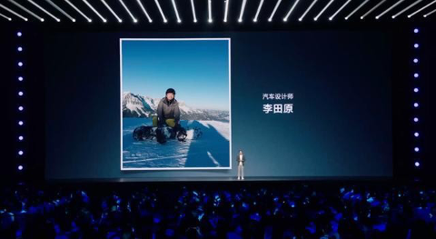

还有胡峥楠，他之前两次拜访过小米。发布会后的一个晚上，他给我打电话说，他造车 20 多年，干过国企，干过民企，自己也创过业。他与前东家的合同到期了，特别想出来看看互联网是如何造车的。后来他加入了顺为，再后来兼任了我的顾问。
 
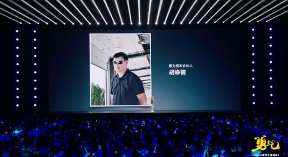
 

就这样，一群热爱汽车的人从五湖四海走到了一起。在短短半年的时间里，我们就组成了一个超过 1000
人的团队。在过去三年多的时间里，我们汽车部门的员工已经超过了 7000 人，更难能可贵的是我们聚
集了超过 1000 位技术专家。发布会对我们组建团队起到了非常大的作用。

前几天，我让我们的 HR 部门统计了一下，三年多时间里我们收到了 38 万份简历。在这里，我特别想说一下，我们还永远欢迎优秀的工程师继续加入小米汽车的团队。如果我们想成为一家全球前五的车厂，我们还需要更多优秀的人才。

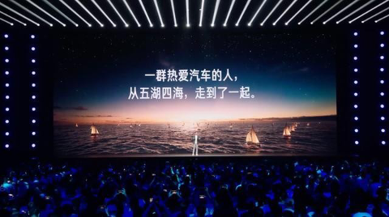

小米造车在社会上引起了巨大的反响，我的一群企业家朋友们也特别关心。4 月 5 日，他们组团到访了小米，带着很多问题。主要是两个问题。

第一个问题是，你们现在才下场是不是太晚了？确实，三年多前相比新势力，我们晚了六七年。当时我是这样回答的：智能化才是汽车的灵魂，而智能化在电动车时代才刚刚开始。而且汽车是一个百年赛道，只要你真心喜欢，只要你真心想干，我觉得任何时候都是最好的时候。
 
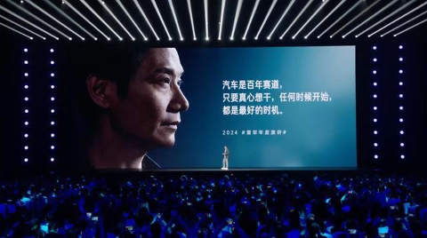

他们问的第二个问题是，为什么小米汽车不拿出来独立融资、独立上市？很多人一听到上市就热血沸腾。当时造车很火，新能源汽车公司的股票飞涨。我跟大家交流时说，的确有几家风险投资公司给小米汽车开价了，当时因为市场特别火，估值  100  亿美元。

各位想一想，小米汽车啥都没有，就估值 100 亿美元。而且用别人的钱造车几乎无风险，谁能拒绝这样的好事？实话实说，我们也动过心，但想来想去，经过深思熟虑后，我们拒绝了。为什么？因为造车的周期很长，如果我们拿了别人的钱，想法和时间要保持一致几乎是不可能的。而且在小米内部造车，大量的人才和技术都可以直接利用。

我非常清楚，造车的难度很大，光靠我一个人肯定不行。我需要小米集团的每个人都能毫无保留地支持，希望大家都能全力以赴一起造车，这样我们才有胜算。

所以最后我们决定小米全资自己干，钱全部自己掏，风险全部自己扛。只要能把车做好，我们在所不惜。

那天，王传福来了，李想也来了，何小鹏也来了，李斌也来了。我还记得后来王传福跟我说，他特别佩服我们的勇气，但是多少还是为我们捏了把汗。

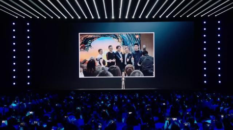

这就是小米造车的起点，如果不是遭遇美国制裁这样意外事件的巨大冲击，我们不会贸然进入汽车这么复杂的行业，也不会有今天的小米 SU7。

所以无论面对何等巨大的危机都不能被吓倒，破釜沉舟的勇气才是我们冲出重围的关键。

## 第二章：先守正，再出奇

当我们决定造车后，其实还面临无数的挑战。

汽车行业每年发布两三百款新车，是一个竞争非常激烈的行业。作为一个新来者，第一辆车非常重要，我们该怎么造车，我们该造一辆什么样的车？

刚开始我们的团队找了一大堆报告，开始学习，开始研究，写了上百页的分析材料，但我忍不住一上来就泼了盆冷水。我说各位不要想这么复杂了，我们能不能先造一辆小米工程师们都想买的车？如果我们自己都不想买的话，那车造出来也没用。

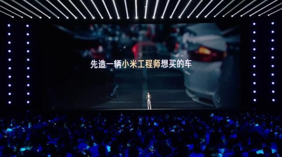

好，第二个问题来了，小米工程师到底想买一辆什么样的车呢？

我们组成的团队还挺专业的，大家的第一反应就是我们找个调研公司，花几个月整份报告。在讨论的时候我再次提醒大家，我说别浪费时间了，100 份报告也替代不了一个真实用户面对面的沟通。

我说，我们应该马上开始，我动员我们所有人不辞辛劳，和我们小米的工程师一个个聊。其实两三个星期我们就聊了 300 多人。

聊完以后大家觉得还不过瘾，就跑到小米的每一个办公区的停车场，一辆一辆去数，看看大家到底开什么车。这个方法看起来很土，但是很简单、很直接、很有效。很快我们就知道大家买的品牌车型和价格段，比如说轿车和 SUV 各占一半。
 
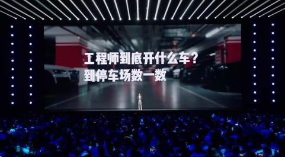

从研发角度来说，高车容易，低车难。做 SUV 相对容易，做轿车要难一些。所以大部分车企都是先做 SUV，但我的观点不一样。我们决定不走寻常路，先从纯电轿车做起，先从难的做起。等轿车做好了，再做其
他车型就容易多了。所以，我们下决心做纯电轿车。

中国的产业链非常成熟，其实电动车还是比较容易造的。

三年多前，有很多朋友劝我说你们已经晚了，赶紧出车，找家代工就可以了，千万不要什么事情都自己干。刚开始我们也这样想过，既找过代工，也想过收购。但是没过多久，我们就下了决心，从核心技术做起，绝对不要想走捷径。

为什么呢？因为之前我们吃过大亏。

14 年前我们小米创业的时候，就是轻模式，从模式创新开始，初期速度很快，但是根基不扎实，后来遇到了很多的挫折。到今天为止，我都觉得我们还在补课。所以当我们再次创业的时候，我们决定不走捷径，不收购、不代工，从核心技术做起，10 倍投入，认认真真造一辆好车。

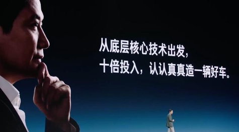
 
当我们下了这个决心后，我们的投入非常坚决。电机我们一上来就做了三代，电池我们也做了两套智能驾驶。我们也做了纯视觉，也做了激光雷达，我们很多技术都是这么干的。

今天我跟大家讲讲电池包。

电池包可能一般人都觉得很简单，实际上还是特别复杂。一个电池包做下来差不多需要十几个月，几千万的投入。所以行业里面开发一辆新车，一般做两个电池包，多的做三个。大家知道我们初期干了多少个吗？我们干了 10 多个电池包，甚至为了把电池包的技术搞明白，我们还自建了一个电池包的工厂。

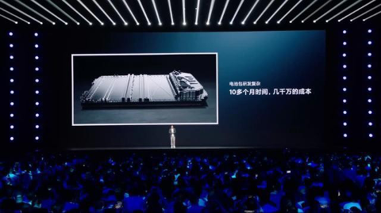

这不仅把我们自己的团队折腾得够呛，把供应商也折腾得够呛。我都有点不好意思了，专门打电话给宁德时代的曾总解释。

曾总说他理解，他当年给 A 公司做过电池，A 公司一款手机其实只需要一个电池方案，他们在研发过程中开了 200 多款，最后只用了一款。他说他理解，只有这样干才能真正把产品做好。

我们就是这样从核心技术出发，10 倍投入。我们的项目一开始，我们就启动了核心技术的研发。就这样，我们披星戴月干了大半年。

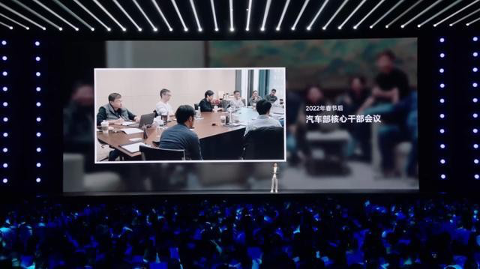
 
到了 2021 年年底，春节前，第一次项目的正式评审会开始了，我们大家都挺激动，结果这个会开下来，开得特别郁闷，大家的分歧特别大，吵来吵去。最后下决心整个产品方案推倒重来。

春节期间，我觉得大家的春节都过得不好，都特别焦虑。我们的项目进度怎么办？春节后上班的第一天，我取消了所有的日程，把我们汽车部最核心的十几个人全部抓过来开会，商量怎么解决。

就这个临时召集的会，谁也没有想到，一开开了整整 21 天，成了一个马拉松式的会议。刚开始大家还
比较矜持，第二天真的就开始了，越来越激烈。有时候一个问题能从早晨 9 点吵到晚上 9 点。

在争论的过程中，我就下了决心，我们的团队什么时候吵明白了，我们就什么时候散会，我们就一直开到吵明白为止。

其实当时我们团队 1000 多人，大家都在等我们这个会议的结果。我们就是在进入压力巨大的时候，把所有的事情放下来了，先吵清楚。

今天回想这个会，对我们很重要，因为我们来自五湖四海，不同的背景，第一次有如此长时间高密度面对面的讨论，帮助了大家相互了解，相互融合。

这 21 天的会我总结下来，我觉得形成了一个最重要的共识：小米作为一个新来者，只要能顺利上牌桌，就是巨大的成功。所以很多人问我说，你们三年为什么能把车造出来？最关键就是这句话。

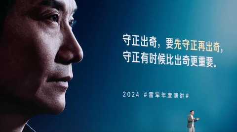

小米造车要尊重行业规律，守正出奇，要先守正再出奇，不要一上来就颠覆，一上来就掀桌子。

所以基于这 21 天的会，我们这十来个人就成了真正的战友，可以背靠背信任，才能应对之后的无数考验。
 
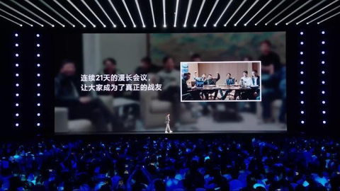

可谁也没想到，考验来得这么快——上海疫情爆发了。

我们有不少工程师在上海，我们研发怎么办？大家手提肩扛，把能扛回去的设备全部扛回了家，在家里做研发。有一位同学就这样把设备搬回家以后，在家里搭了一套工作环境。我们的超级电机的控制软件，在他家的客厅里第一次真正运转起来。

这是一段非常难忘的奇特经历。我们相隔如此遥远，却又感受到如此紧密。我记得初期的很多产品决策就是在各种各样的视频会议中完成的。我们甚至在这个期间还办了几次线上的庆功会，当我们遇到阶段性的成果时，就把红酒寄到每一个同学的家里，大家就联网云喝酒。

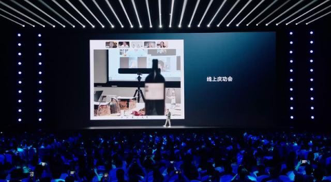

就是由于这样大无畏的革命浪漫主义精神，帮助我们克服了重重困难，我们的项目居然没耽误，居然还能够按计划进行。

到了 2023 年 8 月 16 日，第一辆试产车缓缓地从产线上驶出来。现场所有人都激动不已。谁知，经历了这么多的峰回路转，我们小米 SU7 如期交付，这真的是个奇迹。
 
我相信，创造这个奇迹是我们汽车部的六七千人共同努力的结果。我觉得我们的团队真的挺了不起的，每一个团队都是超水平的发挥。

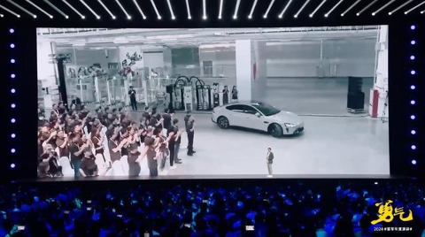

我还记得在下线仪式结束后，大家上去了，我一个人围着市场车转了一圈又一圈，最后打开车门又在里面坐了很久很久。真的不敢相信我们的车真的造出来了，在那个时刻真的百感交集。

所以说到这里，我们选择了做最难的纯电轿车，我们选择了从核心技术做起，我们选择了在项目压力最大的时候，停下来开 21 天的会，这些都需要巨大的勇气与决心。

因为我们深知，只有坚持做正确的事情，我们才能走得更远，小米汽车才能真正成功。

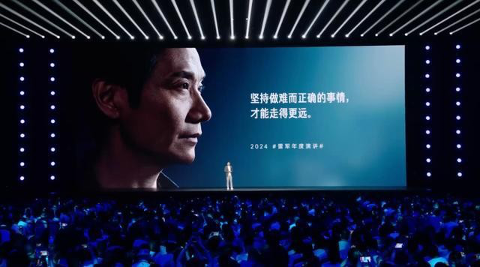

## 第三章：干一行，爱一行

过去三年时间里，其实我自己琢磨最多的是，既然我带队，我怎样才能把车做好。我琢磨了很久，后来我发现答案其实很简单：懂一行，爱一行，才能做好这一行。

如果要造好车，我一定要懂车，一定要爱车，才有机会把车做好。
 
我个人造车的第一步，大家可能不信——我的第一步就是自己开车。

说实话，10  多年前由于工作繁忙，公司给我配了专职司机，从那以后其实我很少开车。当我决定造车的那一天起，我就下决心自己开车，重新开始开车，就像新手上路，手忙脚乱的。我确实花了好几天才慢慢适应。当时我让司机坐在副驾驶，同事们看到以后就开玩笑说：「你的司机好有面子，老板亲自开车。」

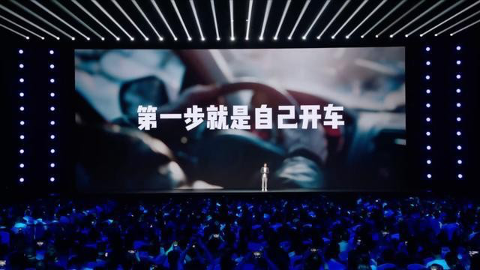

因为我们小米汽车来了很多有经验的同学，他们都干了一辈子的车，见多识广，开过很多车，经验非常丰富。聊起来，他们对每个细节都了如指掌。

其实我跟他们工作的时候，我有巨大的压力。我后来想，我一定要尽快补上这一课，我一定要自驾足够多的车，我要迅速抹平这个信息鸿沟。所以我首先就跟周围的朋友去借车开，接着就跟周围的同事借。结果一两个月的时间就全部借完了，为什么呢？因为他们买的车型都差不多。

后来我就决定，要不把各个品牌的 4S 店都逛一遍，然后去那边看车、试驾。每次去我都戴着帽子，戴着墨镜，全副武装的，但是好像没啥用，很快就被认出来了，所以特别尴尬。

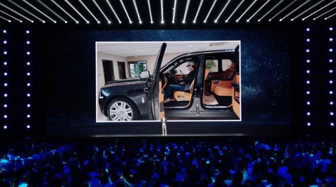
 
后来我找了一个好办法，我就在我们小米的地下车库里转，看见没开过的车就让助理去借。助理就在上面贴个借车的条，有很多同事很惊讶，说真的是雷老板要借吗？还专门打电话问我是不是真的。

好，我借到车以后，我特别喜欢跟车主聊天，一般我主要问三个问题：这辆车好在哪里，不好在哪里？你当时为什么要买这辆车？假如你要换车，你打算换一辆什么样的车？

然后车主跟我讲的我都记下来，接着我再认认真真地开个一两天。这还不算完，我接着再去上网找跟这辆车所有相关的资料，再去看网上的各种各样的评论，然后再把它们记下来。这样的话，我对一辆车的认知就完整了。然后我再加满油，洗好车，然后再还回去。

不知不觉三年下来，我大概试驾了 170 多辆车。前几天我整理了一下笔记和资料，居然有 20 多万字。

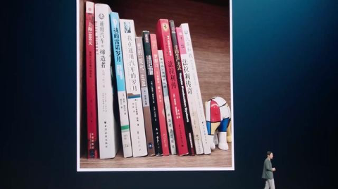

所以我是认认真真地把这一课要补起来，为了补课，我还专门抽时间看了很多汽车巨头的传记，甚至把过去看过的赛车电影全部找出来，又重看了一遍。以前主要是看明星、看剧情、看热闹，这一次不是，这次主要看车。

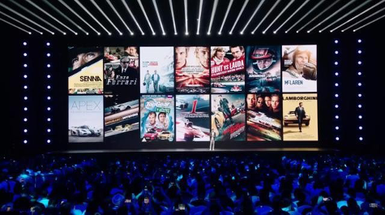
 
看完了以后，特别多的感慨就是为什么人家法拉利做得好，保时捷做得好？你看看人家老板，人家的创始人都是赛车手。真的，你说你不懂你怎么能把车做好？

我心里就开始想，我说我能不能定个小目标，我能不能够成为国内车企老板开车最好的之一？低调。

还有我能不能去开赛车。当有这个想法以后，我的第一反应是开赛车是不是很危险？而且像我这样的「年轻人」去开赛车是不是有点不靠谱？

我想了很久，还是下决心去试试。当然赛车驾照要先考个赛照。我的赛道是夏天学的，可能我不知道大家对赛车有多了解，因为赛车主要是处理赛道上的极致工况，所以赛车里面能拆的都拆了，基本上都把空调拆了。

各位想一想，北京的夏天温度一高，有时候 40 度，然后车里都是 60 度，热得要死。而且各位再看一下，这就是我学赛车时候的照片。

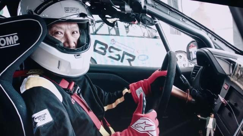

穿着防火材料做的赛车服，戴上这么大的头盔，还有坐的运动座椅。运动座椅是超硬的，可能很多人不理解为什么那些性能车和运动车的座椅都硬得不得了，是因为要有路感。你的车压过一个石子，你都能够迅速感受到。所以赛车和那些豪华车，那些性能车座椅都很硬。

还有我们安全带，可是 6 项安全带在开车的时候都是往死里勒的，勒得你都有点痛。像这么全副武装，在车上坐好的时候是不是看起来很帅，实际上非常不舒服，非常不舒服。几十圈跑下来全身湿透，就像洗了一次桑拿，反正每次休息的时候我都觉得像虚脱了似的。

而且新手学赛车一不小心就冲出了赛道，一不小心而且很容易就撞上了防护墙。老司机管这叫「上墙」，说你开赛车上过墙没有？每一个墙上好几遍，你这个赛车才能开得好。
 
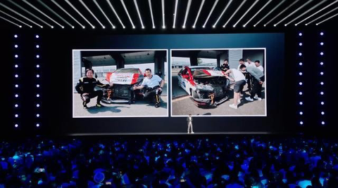

我们平时开车撞一次车是天大的事情，但是一旦开赛车就稀疏平常了，而且赛车是没有保险的，被撞了的话只能自认倒霉，自己修车。无论是你撞别人还是被撞，都是各修各的车。

好，我让大家看一看，反正我们每次有同事撞了都挺激动，因为平时大家开车都很小心，基本上都很认真，但是在赛场上是经常出现。

所以说到这里，赛车的话，看起来很危险，实际上也不安全。在这里我要提醒大家，就是我们开赛车的时候一定要注意安全，最重要的是你的赛车一定要经过改装，要改刹车、轮胎，甚至我们改了安全座椅，还装了防滚架。只要你遵守规则，我觉得安全系数还是很高的。

所以这是我在学赛道时教练就反复要求的，就是一定要遵守规则。你的车不能拿一般的民用车去跑赛道。

为了把赛车学好，我还买了一个很高级的 7 轴模拟器，在家偷偷练，吃了不少苦。最后我终于拿到了赛
照。我不仅仅自己练，我逼着小米的团队也去练。我们的管理团队和工程师超过了 100 人拿到了赛照，因为我相信一支真心热爱汽车的团队才能真正把车做好，你们同意吗？

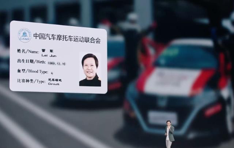
 
当然了，我现在开车在赛车手里是业余中的业余，但是为了提高水平，我们经常内部还举办各种比赛。然后大家看看我们比赛的视频录像，前面那辆车就是我，前面过一个  U  型弯，你看我切弯的动作很标准。光这辆车把我撞出去了。

对，可笑的是这个同学第二圈又在同一个弯。他都这么走了，又是个 U 型弯，咣，又撞了一下。反正我就这么被撞了两次，修车就修了两万五。

我觉得玩赛车以后，我对车的认知进了一大步。因为之前自己开车，我从来没有开过地板油，地板油就是一脚踩死油门，遇到刹车的时候也是一脚踩死。而且我也不知道什么叫转向精准，什么叫操控，什么叫指哪打哪，开完赛车以后全明白了。

后来才发现这个车跟车差距真的大极了，车跟车差距非常之大，更深地理解了什么叫人车合一。所以我真的觉得学下来以后对我帮助是挺大的，而且我对我们汽车研发的每一个关键节点，我都力争能够自己亲自参加。

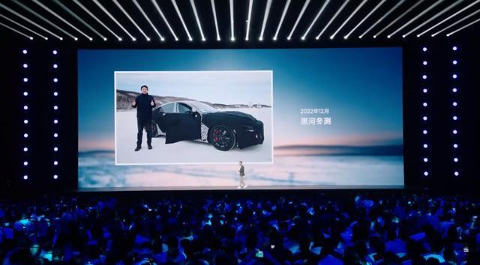

2022 年年底，我们的工程车如期开始了第一次冬测。那是在黑河，零下三四十度非常冷，这对于小米汽车来说是第一次大考，我特别重视，我和我们管理团队都亲自去了现场。

我们负责冬测的负责人见到我以后非常惊讶，他说他干了 20 多年，第一次看到董事长来冬测的第一次。晚上吃饭的时候，还按食堂专门加了个菜，说今天董事长来。
 
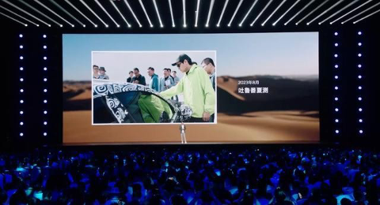

寒来暑往，第二年我又参加了夏测，在吐鲁番的夏天，气温高得能达到 50°C。各位想一想，你的车在阳光下 50°C 的温度暴晒，一中午车里有多烫？我看我们有的对标车车里的温度高达 90°C，真的让你痛苦得不得了。

我在下车的那一瞬间，真的觉得 SU7 把防晒做好真的是太重要了。我们车里的温度能比别人低十几（摄氏）度，所以夏测虽然艰苦，但也一样留下了很多美好的回忆。

我今天能回想起来的是什么？是吐鲁番的西瓜。吐鲁番的西瓜又大又甜，一个都是  20  来斤，特别好吃，而且便宜到你不敢相信。他们那的价格不是按斤算的，是按公斤算的。各位，你们知道吐鲁番的西瓜一公斤多少钱吗？一公斤五毛钱。

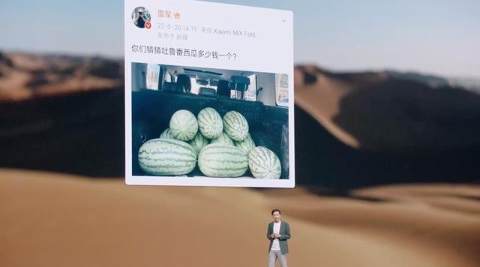

我们现在正在吐鲁番的兄弟告诉我说，今年西瓜更便宜了，一公斤三毛钱。一个 20 多斤的西瓜只要三
块多钱。便宜到我忍不住背了四、五个回北京，结果发现运费是西瓜钱的 100 倍。

而且，因为小米第一次造车，我觉得质量对我们非常重要。在今年 1 月份，我们还开展了整个行业最大
规模的路面测试。实车路测我们投入了 576 辆样车，测试了 300 多个城市的大街小巷，周围的所有公
路，总测试里程达到了 540 万公里。
 
我觉得今年年初大家应该都看到过，我们的测试车队覆盖面非常广，应该是行业里第一次大规模的测试。有网友就评价说：「你们小米汽车行不行，就看你们高管敢不敢自己开。」我们有一位工程师看到以后，专门转到群里，专门 @ 了我。

他的意思我懂，我又默默地转到了高管群，并专门 @ 了所有人。我觉得我们小米的高管素质还都挺高的，立刻全体响应，全部参与了测试。他们要用自己来证明小米汽车是靠谱的。

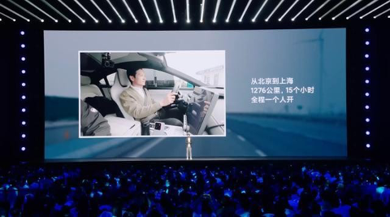

然后我们所有的高管在初期上市前测试了超过 10 万公里。我自己的话，测试了 10 多次，累计测了
5000 公里。我觉得我最难忘的一次是什么呢？是今年 1 月份从北京到上海，早晨 6 点到晚上 9 点，
15 个小时，一个人开了 1276 公里。我觉得我从来没有想过我一个人能开这么远。

回想这个事件，实话实说，刚开始我们的公关同学是不让我这么做的。他们不担心小米 SU7，他们担心我，说：「雷总，你万一蹭了剐了怎么办？一不小心就成了舆论危机。」我一边在开，他们一边很多人盯着我开，你知道吧？比我都紧张很多倍。

结果一路上非常顺利，而且我觉得今天的高速公路再加上智能驾驶，我觉得整个体验还是蛮轻松的。而且这次测试下来的最让我意外的收获就是冬季高速，我觉得小米 SU7 的续航特别给力，这一点让我特别踏实。

我觉得正是因为我们在电池技术上下了这么大的功夫，我们才有如此杰出的表现。

所以说到这里，我觉得你看重新自己开车、学赛车、亲自参加冬测夏测，还有长途测试，其实看起来都是小事，都很简单。但是我的体会是什么呢？勇气不是口号，而是每一步脚踏实地的行动，大家同意吗？

说到这里，网友在过去的几个月不停地催我，说：「啥事你表演一下漂移。」我后来想起来了，我有一次直播吹牛，我说我会漂移。从那以后就每个人都催我。当我真正打算去漂的时候，我发现其实我的确能漂得起来，但是水平很一般。
 
我想这个视频要是出来以后，不少专家肯定要把我骂死。前一段时间鼓起勇气拍了一段，拍的不好，大家凑合看看行吗？不接受什么一帧一帧的看，就是糊弄点看就行了，好不好？还挺帅的。好，大家一起来看一下，雷军表演漂移。

## 第四章：凭勇气挤上牌桌

好，我们就是这样紧锣密鼓，埋头苦干了三年多时间。在研发的过程中一直非常低调，一直也没有做任何宣传，大家看到的东西要不就是谣传，要不就是泄密，真的没有做任何宣传。

去年年底 12 月底，小米汽车第一次亮相，很多人觉得很突然，觉得有点横空出世。所以刚开始热度特别高，但没过几天扑面而来的就是各种质疑，批评诋毁。最经常说的一句话是：

「苹果 3 年，苹果 10 年都干不成，凭啥你们 3 年能干成？」

我觉得这个问题非常难以回答，我咋知道苹果为啥 10 年不成？你们为什么不问问蔚来、小鹏他们几年干成的？其实这个产业都已经很成熟，我觉得三年干成就是一个标准。

其实，这个产业已经非常成熟，我觉得三年内干成就是一个标准的时间。所以我也不知道怎么回答。反正黑稿像潮水般袭来，再加上几家友商推波助澜，漫山遍野的调侃和嘲讽。

有一句话大家应该都听说过：「军儿，收手吧，外面都是 XX」，大家看到过吧？

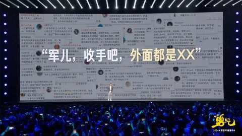

我觉得这些都是小事，真正的困难是我们倾尽全力做的车，倾注了我们这 7000 人无数的心血做的车。
 
我们上市前的两三个月跟大家沟通交流的时候，居然发现所有人都认为卖不动，给我急得不行。我跟他们说我们的配置和体验都比 Model 3 好很多，人家跟我说买电动车的都是特斯拉的粉丝，他们肯定不会买小米 SU7 的。我说那好吧，那「34C」的用户该不该升级成更智能的电动车？

我不知道大家知不知道「34C」这个词，就是宝马 3 系、奥迪 A4、还有奔驰 C 级，简称「34C」，就是 BBA 的入门款。我说那这些用户是不是要升级成更智能的电动车呢？价位差不多，产品更好。

我们的几个部门跟我整了三份报告，每份洋洋洒洒几十页，我看完都只有核心一句话，说人家「34C」的用户买的全是品牌，他为啥买你小米 SU7？反正一句话我就被噎住了。

还有我们精心为女车主设计的防晒、收纳功能，虽然好看，但很多人说女车主肯定不买这样的性能车。

那咋办？你像我们干了三年多，这么多人花了一两百亿，最后做完了卖不动，我就按市场部的建议请一些媒体的朋友们来帮忙出主意，一共请了 23 位。万万没想到，绝大部分人都不看好，他们认为能卖 3000辆就要烧高香了，这就是当时大家的结论。

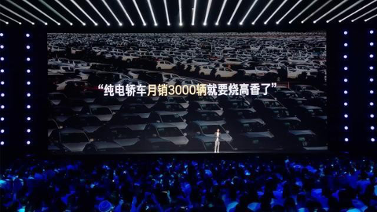

我觉得大家说的都是心里话，当时我有点不服气，就尝试去说服他们。当然，他们对行业都非常了解，比我经验都多。我说了两三个小时，说到口干舌燥，完全没用，改变不了他们的观点，所以让人无比绝望，我们整个团队都笼罩在焦虑之中。

我不知道大家还记不记得，大概就是今年 3 月，很多人都说我憔悴了。正好网上有几张不堪回首的照片，说我憔悴了，反正在那个时候我是极度郁闷。

在我最郁闷的时候，我想起来我试驾过的一辆车。那是我们一个同事买的车，我借来试驾过几天，那是一辆福特野马，40 多万的性能车。
 
同事跟我说，那辆车就是他的 Dream Car，是他工作了 10 年之后积攒的钱买给自己的。每天早晨一上班，坐到车里踏下油门的一刹那，他就热血沸腾；每天晚上回家了，还在车里再坐一会儿再上来。我此时此刻都能回想起他当时跟我讲的这些话造成的冲击。

我真的相信人生值得被奖励，这就是一辆 Dream Car 的意义。

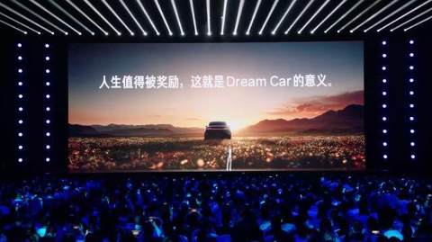

我们的小米 SU7 其实就是为他这样的奋斗者设计的，我相信人们对 Dream Car 的向往。我相信三年多时间，我们整个团队全力以赴的投入，我也相信小米 SU7 的魅力和强大的产品力。所以无论多少人不看好，但我始终坚信小米 SU7 一定会大卖。

其实真正考验我的信心的，是今年 2 月份要确定产能。

汽车生产很复杂，供应链条很长，我们 2 月份要确定全年产能，要订多少货。很多人建议订 3 万辆，稳点好。我内心是非常矛盾的：定多了担心卖不掉，定少了担心不够卖，大家又骂我饥饿营销。

我还记得在二三月份我接受央视一个采访，我就直说了，我既怕卖不动，也怕不够卖，是极度矛盾的。但在这个时候，我的这份自信让我下了决心。

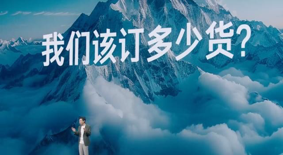
 
各位，大家知道我们在年初定了多少吗？76000 辆。这意味着什么？扣掉爬坡时间，就是月销 1 万。纯电轿车月销 1 万的只有一辆车，就是特斯拉的 Model 3。也就是说，我从第一天就下的目标就是数一数二。如果卖不出去意味着什么？

可能大家对车卖不出去没概念。大家看我那个工厂很大是吧？各位，我那个工厂只能存三天的车。大家想一想，一个能停 1000 辆车的车库有多大？如果你有 1 万辆车卖不掉，你要租多少个足球场停车？反正车一开始库存，那就是漫山遍野，这对我们来说是个灭顶之灾。

76000 辆，我深知这是个疯狂的目标，但我也很清楚，其实我们没有退路。我们就像过河的卒子一样，只能拼命往前冲。

就在我巨大的焦虑中，我们离发布的日期就越来越近了。在 3 月中旬发布会前，我们办了唯一一次的媒体试驾会。媒体老师们第一次真正接触了小米 SU7，有一些人的观点开始改变了。

他们说无法想象这是小米造的第一辆车，它的完成度是如此之高，价值感和质感也特别高，也特别高级。他们说小米确实有高人，我悬着的心才稍稍踏实了一下。

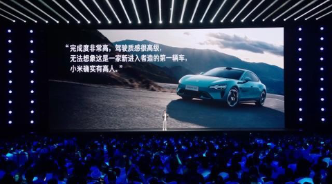

但更大的难题是定价，价格定错了，后果不堪设想。

上百亿的损失，三年的时间付诸东流。但是很多并不了解，因为新能源汽车跟纯电车是两个概念。新能源汽车包括了增程式、插电混动这些车，是油电混合的；纯电车成本很高，除了特斯拉，几乎所有纯电车都在巨额亏损。所以合理定价我们的业务才能持续成长。超低价只是饮鸩止渴。

当时网上有谣传说小米 SU7 要订多少？14.9 万，甚至有人说 9.9 万。这太离谱了，你这不捣乱吗？

当然，更大的压力来自于我们内部。我们销售的同学们都是老板，是很有经验，他们对于纯电轿车一直信心严重不足。在发布会的前一天，我们最后的价格决策会时间不长，但争论非常激烈。
 
我认为我们的 SU7 配置和体验远超 Model 3，我觉得我们要有勇气定到 21.59 万。这个已经比 Model 3 便宜 3 万，我觉得竞争力已经非常强大。

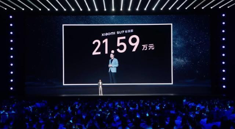

但销售的同学们还是非常担忧，我讲完以后，整个会场一片寂静。我真的很无助，一片寂静，直到现场的一位高管说：「就定这个价，无论卖多少量，我们小米都认了。」

3 月 28 号发布会，我极度紧张，嗓子沙哑，就像 10 年寒窗苦读的学生终于参加高考，我在台上大概讲了半个多小时，才一步一步放松下来。

讲到小米 SU7 为谁做的时候，三年来压在我内心的很多话脱口而出。我说小米 SU7 就是为这样一群人做的：

他们不甘于平庸，还在为梦想奋斗；他们向往先进的科技，渴望幸福的生活；他们心中有火，眼里有光，浑身都闪耀着乐观与自信的光芒。

当我公布定价，现场的观众一片欢呼，我心里踏实了。

小米 SU7 发布会后我接受媒体采访，一个同事非常激动地跑进来告诉我：「4 分钟破 1 万，27 分钟破 5 万。」那一刹那仿佛一切都如此美好，三年来所有的痛苦、委屈、不被理解，全部烟消云散。

而且同事告诉我，有很多用户没有试驾过小米 SU7，甚至没有见到过车，就直接预定了。而且有一个朋友讲了一位米粉的故事，更让我特别感动。
 
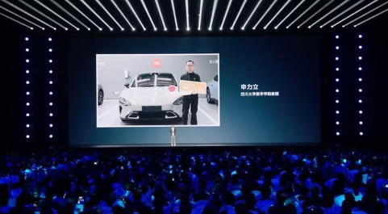

这位米粉叫申力立，39 岁，是川大数学学院的一位教授。他是米粉，多年来一直默默地支持小米。三年多前小米官宣造车，他觉得这是小米的关键时刻，他必须要站出来支持，然后第一时间在小区里买了一个车位留给小米汽车。他在发布会当晚第一时间下了订单，如今空置了 3 年多的车位，等来了创始版的小米 SU7。

这就是米粉朋友们小米的信任。

各位，我们再看一下收车仪式，我弯腰为车主开车门的时候，这是对米粉朋友们发自肺腑的感激。无意之举在网上火了，就成了千亿  CEO  开车门的段子。后来搞得车企老板们都要去开车门；到了北京车展，我就成了别人眼里的营销之神，行走的流量。说以前车展看车模，现在车展看  CEO。

我知道这全部来自于小米 SU7 的巨大成功和一眼万年的魅力，在小米 SU7 的巨大成功下，在所有合作伙伴的共同努力下，5 月份我们发布了新的交付目标：年底我们保底交 10 万辆，力争 12 万辆。

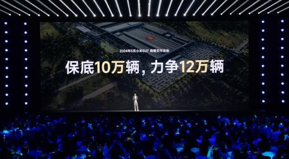

因为我们 4 月份才开始上市，只有 9 个月的时间要干 12 万辆，再加爬坡，这个目标对整个小米汽车的供应链的所有合作伙伴都是一个巨大的挑战。所以这就是我们对米粉朋友们的承诺。
 
小米 SU7 首战告捷，这意味着小米汽车终于挤上了牌桌。

但我们离真正的成功还差很远，我们的长征才刚刚开始。过去的三年，我对于小米都是一段脱胎换骨的经历。小米 SU7 成功的背后凝聚着巨大的勇气，这不是某一个人的勇气，这是我们小米集团 4 万多名员工共同的勇气。

勇气并非没有恐惧，而是面对恐惧的时候依然坚定不移。勇气来自于坚定的信念，奔涌不息的热情，还有每一步的脚踏实地。勇气就是人类最伟大的赞歌。

朋友们，愿你任何时候都拥有勇往直前的决心和披荆斩棘的勇气。
